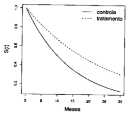

## Pacotes e opções

```{r setup, include=FALSE}
knitr::opts_chunk$set(echo = TRUE)
```

```{r pkgs}
library(survival)
```


## Exercícios

### 5.1

Em um estudo, ajustou-se um modelo exponencial aos tempos de sobrevivência observados (em meses) nos grupos controle e tratamento. Os modelos encontrados foram:

|           $S_c(t) = exp(-0,07t)$, para o grupo controle e
|           $S_tr(t) = exp(-0,07t)$, para o grupo tratamento

Com base nesses modelos, responda:

a. Qual foi o risco instantâneo estimado para o grupo controle? E para o grupo recebendo tratamento?
b. Qual foi a sobrevivência média e mediana no grupo controle? E no grupo recebendo tratamento?
c. As duas curvas estimadas de sobrevivência são apresentadas na figura a seguir. Localize, nessa figura, o tempo mediano e médio calculado. Analisando o gráfico, você acha que o tratamento teve efeito na sobrevivência desses pacientes?

```{r figura_51, echo = FALSE}

```

O risco instantâneo estimado pode ser obtido através da seguinte expressão:

$$\lambda(t) = f(t)/S(t)$$
Sendo $f(t) = \alpha exp(-\alpha t)$ e $S(t) = exp(-\alpha t)$, e $\alpha_{c} = 0,07$ e $\alpha_{tr} = 0,04$, podemos afirmar que:

O risco instantâneo para o grupo de controle é: $$\lambda _c(t) = \frac{0,07 exp(-0,07 t)}{exp(-0,07 t)} = 0,07$$
E para o grupo de tratamento é: $$\lambda _{tr}(t) = \frac{0,04 exp(-0,04 t)}{exp(-0,04 t)} = 0,04$$

A sobrevivência mediana pode ser estimada igualando $S(t) = 0,5$, enquanto o tempo médio de sobrevivência no modelo exponencial pode ser estimado por $\frac{1}{\alpha}$.

Ou seja, para o grupo de controle, o tempo médio de sobrevivência é dado por $$\frac{1}{\alpha_c} = \frac{1}{0,07} = 14,2857$$ e o tempo mediano de sobrevivência é dado por $$0,5 = exp(-0,07t)$$ $$\frac{\ln(2)}{\alpha_c} = \frac{\ln(2)}{0,07} = 9,9$$

Ou seja, para o grupo de tratamento, o tempo médio de sobrevivência é dado por $$\frac{1}{\alpha_{tr}} = \frac{1}{0,07} = 14,2857$$ e o tempo mediano de sobrevivência é dado por $$0,5 = exp(-0,04t)$$ $$\frac{\ln(2)}{\alpha_{tr}} = \frac{\ln(2)}{0,04} = 17,3$$

Podemos plotar as curvas de sobrevivência com os pontos relevantes para a sobrevivência mediana e média nas duas curvas:

```{r q51}
# Curve para a plotagem de CONTROLE
alfa = 0.07
curve(exp(-alfa * x), from = 0, to = 25, ylab = "S(t)", xlab = "Tempo")

# Mediana do modelo exponencial
p50 <- log(1/0.5)/alfa

# Média do modelo exponencial
pm <- 1/alfa

# Segmentos de reta e pontos para a plotagem
# Mediana
segments(p50, 0, p50, exp(-alfa * p50), lty = 3)
segments(-1, exp(-alfa * p50), p50, exp(-alfa * p50), lty = 3)
points(p50, exp(-alfa * p50), pch = 16)

# Media
segments(pm, 0, pm, exp(-alfa * pm), lty = 3)
segments(-1, exp(-alfa * pm), pm, exp(-alfa * pm), lty = 3)
points(pm, exp(-alfa * pm), pch = 16)

# Curve para a plotagem de TRATAMENTO
alfa = 0.04
curve(exp(-alfa * x), from = 0, to = 25, ylab = "S(t)", xlab = "Tempo", add = TRUE, lty = 2)

# Mediana do modelo exponencial
p50 <- log(1/0.5)/alfa

# Média do modelo exponencial
pm <- 1/alfa

# Segmentos de reta e pontos para a plotagem
# Mediana
segments(p50, 0, p50, exp(-alfa * p50), lty = 3)
segments(-1, exp(-alfa * p50), p50, exp(-alfa * p50), lty = 3)
points(p50, exp(-alfa * p50), pch = 16)
text(p50, exp(-alfa * p50), "Mediana", adj = c(1.5, -0.25))

# Media
segments(pm, 0, pm, exp(-alfa * pm), lty = 3)
segments(-1, exp(-alfa * pm), pm, exp(-alfa * pm), lty = 3)
points(pm, exp(-alfa * pm), pch = 16)
text(pm, exp(-alfa * pm), "Média", adj = c(1.5, -0.25))

# Legendas
legend("topright", c("Controle", "Tratamento"), lty = 1:2)
```

Tanto pela análise gráfica, quanto pela análise dos tempos, é provável que o tratamento tenha tido efeito na sobrevivência dos pacientes.

## 5.2

Estude no R o efeito do parâmetro $\alpha$ no modelo paramétrico exponencial.

a. Construa gráficos da função de sobrevivência utilizando $\alpha = 0,1$, $\alpha = 0,5$ e $\alpha = 0,7$.
b. Calcule o tempo mediano de sobrevivência para modelos com $\alpha = 0,1$, $\alpha = 0,5$ e $\alpha = 0,7$.
c. Calcule os percentis 90% (P90) e 10% (P10), isto é, os tempos em que 90% e 10% dos pacientes ainda não tinham sofrido o evento.
d. O que você conclui sobre o parâmetro $\alpha$ e seu comportamento no modelo exponencial de sobrevivência?

```{r q52_graficos}
# Funções de sobrevivência
alfa_1 = 0.1
alfa_2 = 0.5
alfa_3 = 0.7


curve(
  exp(-alfa_1 * x),
  from = 0,
  to = 25,
  ylab = "S(t)",
  xlab = "Tempo",
  main = expression(paste(Parametro, " ", alpha)),
  ylim = c(0, 1),
  lty = 1
)
curve(
  exp(-alfa_2 * x),
  from = 0,
  to = 25,
  ylab = "S(t)",
  xlab = "Tempo",
  add = TRUE,
  lty = 2
)
curve(
  exp(-alfa_3 * x),
  from = 0,
  to = 25,
  ylab = "S(t)",
  xlab = "Tempo",
  add = TRUE,
  lty = 3
)
legend("topright",
       legend = expression(alpha == 0.1, alpha == 0.5, alpha == 0.7),
       lty = 1:3)
```

```{r q52_mediana}
# Tempo mediano de sobrevivencia
# alpha = 0.1
log(1/0.5)/alfa_1
# alpha = 0.5
log(1/0.5)/alfa_2
# alpha = 0.7
log(1/0.5)/alfa_3
```

```{r q52_percentis}
# Percentis
# alpha = 0.1
# p90
log(1/0.9)/alfa_1
# p10
log(1/0.1)/alfa_1

# alpha = 0.5
# p90
log(1/0.9)/alfa_2
# p10
log(1/0.1)/alfa_2

# alpha = 0.7
# p90
log(1/0.9)/alfa_3
# p10
log(1/0.1)/alfa_3
```

Sendo o único parâmetro da distribuição exponencial, alfa governa o nível ou a intensidade com que a curva de sobrevivência decresce. Em outras palavras, quanto maior o alfa, mais rapidamente os pacientes evoluem para o evento e menores seram as medidas de sobrevivência, como a mediana e a média.

## 5.3

Com relação ao modelo paramétrico Weibull, responda:

a. Por que o modelo Weibull é considerado mais flexível do que o modelo exponencial?
b. Em que situação particular o modelo Weibull é equivalente ao exponencial?
c. Qual a relação entre o parâmetro de forma $\gamma$ e o comportamento da função de risco?
d. Quais das curvas de risco apresentadas na Figura 3.3 não poderiam ser modeladas pela função Weibull, nem mesmo aproximadamente?

O modelo Weibull agrega um segundo parâmetro de forma $\gamma$ adicional ao parâmetro $\alpha$ de nível e, por isso, consegue alterar o formato da curva de maneira mais substancial e modelar situações em que o risco cresce ou decresce ao longo do período de estudo. No evento em que o risco seja constante ao longo do estudo, o modelo de Weibull torna-se idêntico ao exponencial e o valor de $\gamma$ se iguala a 1. No caso do parâmetro $\gamma > 1$, o risco é crescente ao longo do tempo, já no caso de $\gamma < 1$ o risco decresce com o tempo. Observando a figura 3.3 reproduzida abaixo, é evidente que não possível utilizar a distribuição de Weibull para as figuras D, E e F, pois o padrão de risco não é uniformemente crescente ou decrescente.

```{r fig3_3, echo = FALSE}
knitr::include_graphics("figura_3_3.png")
```

## 5.4

Seja T o tempo de sobrevivência de até a ocorrência de um evento que segue uma distribuição Weibull com parâmetros $\gamma = 1,5$ e $\alpha = 0,13$.

a. Faça gráfico das funções de sobrevivência $S(t)$, de risco ($\lambda(t)$) e de risco acumulado ($\Lambda(t)$).
b. Use o R para construir os gráficos das funções acima.
c. Calcule o tempo mediano de sobrevivência, e os percentis 80 e 10 dessa distribuição.
d. Fixe o valor do parâmetro $\alpha = 0,13$ e faça gráficos da função de risco e da função de sobrevivência para diversos valores do parâmetro de forma $\gamma$:
    i. $0 < \gamma < 1$,
    ii. $\gamma = 1$,
    iii. $\gamma > 1$
e. Interprete como o parâmetro de forma $\gamma$ afeta o comportamento do risco e da sobrevivência.

```{r q54_grafico}
alfa = 0.13
gama = 1.5

par(mfrow = c(2, 2))
# Sobrevivencia
curve(
  exp(-(alfa * x) ^ gama),
  from = 0,
  to = 20,
  ylab = "S(t)",
  xlab = "t",
  main = "Sobrevivência"
)
# Risco
curve(
  alfa * gama * (alfa * x) ^ (gama - 1),
  from = 0,
  to = 20,
  ylab = expression(lambda(t)),
  xlab = "t",
  main = "Risco"
)
# Risco acumulado
curve((alfa * x) ^ gama,
      from = 0,
      to = 20,
      ylab = expression(Lambda(t)),
      xlab = "t",
      main = "Risco acumulado"
)
```

```{r q54_percentis}
# Tempo mediano de sobrevivencia
log(1/0.5)^(1/gama)/alfa
# P80
log(1/0.8)^(1/gama)/alfa
# P10
log(1/0.1)^(1/gama)/alfa
```

```{r q54_alfa_var}
gama_1 = 0.25
gama_2 = 1
gama_3 = 1.75

# Gama = 0.25
par(mfrow = c(1, 2))
# Sobrevivência
curve(
  exp(-(alfa * x) ^ gama_1),
  from = 0,
  to = 20,
  ylab = "S(t)",
  xlab = "t",
  main = expression(gamma == 0.25)
)
# Risco
curve(
  alfa * gama_1 * (alfa * x) ^ (gama_1 - 1),
  from = 0,
  to = 20,
  ylab = expression(lambda(t)),
  xlab = "t",
  main = expression(gamma == 0.25)
)
# Gama = 1
par(mfrow = c(1, 2))
# Sobrevivência
curve(
  exp(-(alfa * x) ^ gama_2),
  from = 0,
  to = 20,
  ylab = "S(t)",
  xlab = "t",
  main = expression(gamma == 1)
)
# Risco
curve(
  alfa * gama_2 * (alfa * x) ^ (gama_2 - 1),
  from = 0,
  to = 20,
  ylab = expression(lambda(t)),
  xlab = "t",
  main = expression(gamma == 1)
)

# Gama = 1.75
par(mfrow = c(1, 2))
# Sobrevivência
curve(
  exp(-(alfa * x) ^ gama_3),
  from = 0,
  to = 20,
  ylab = "S(t)",
  xlab = "t",
  main = expression(gamma == 1.75)
)
# Risco
curve(
  alfa * gama_3 * (alfa * x) ^ (gama_3 - 1),
  from = 0,
  to = 20,
  ylab = expression(lambda(t)),
  xlab = "t",
  main = expression(gamma == 1.75)
)
```

O parâmetro gama afeta principalmente os formatos das curvas de sobrevivência e risco. No caso da curva de sobrevivência, um valor de $0 < \gamma < 1$ descreve uma distribuição em que os desfechos se concentram no início do tempo de observação, enquanto $\gamma > 1$ descreve uma distribuição em que os eventos tendem a ocorrer mais tarde. No caso da curva de risco, o primeiro caso é no qual o risco descrece exponencialmente, enquanto o segundo o risco cresce exponencialmente. O caso em que $\gamma = 1$ é apenas uma distribuição exponencial comum, no qual o parâmetro não oferece nenhuma informação adicional.

## 5.5

Em um estudo sobre o tempo de incubação de uma infecção verificou-se que T é adequadamente descrito por uma função Weibull com parâmetros $\gamma = 1,2$ e $\alpha = 0,07$.

a. Calcule o tempo mediano de incubação desta infecção.
b. É correto dizer que 10 horas após a infecção, espera-se que 80% das pessoas já tenha desenvolvimento sintomas?
c. O risco de surgimento de sintomas é crescente ou decrescente ao longo do tempo?

```{r q55}
alfa = 0.07
gama = 1.2

# Tempo mediano de incubação
log(1/0.5)^(1/gama)/alfa

# Quando 80% das pessoas desenvolveu sintomas?
log(1/0.2)^(1/gama)/alfa

# Função de risco
curve(
  alfa * gama * (alfa * x) ^ (gama - 1),
  from = 0,
  to = 20,
  ylab = expression(lambda(t)),
  xlab = "t",
  main = "Risco"
)

```

Podemos ver acima o tempo mediano da infecção e que levou `r log(1/0.2)^(1/gama)/alfa` horas para que 80% das pessoas manifestassem sintomas, por fim, o gráfico mostra o risco crescente ao longo do tempo, consistente com o parâmetro $\gamma > 1$.

## 5.6

Mil crianças não vacinadas são acompanhadas, a partir do nascimento, em um estudo cujo objetivo é identificar a idade em que adquirem hepatite A. Os resultados do estudo indicam que média da soroconversão das crianças foi de 4,5 anos e que o risco de contrair hepatite A foi constante e independente da idade.

a. Proponha um modelo paramétrico para o tempo até a aquisição de hepatite A.
b. Faça no R o gráfico da função de sobrevivência, de acordo com esse modelo.
c. Com base nesse modelo, em que idade espera-se ter 90% das crianças soropositivas?
d. Após esse estudo, um projeto de saneamento é implementado nesta comunidade. Para avaliar o efeito do saneamento na transmissão de hepatite A, uma nova coorte é montada, semelhante à anterior. Ao analisar os dados dessa nova coorte, encontramos que um modelo Weibull com parâmetros $\gamma = 1,3$ e $\alpha = 0,1$ descreve bem a curva de sobrevivência. Com base nessa informação, avalie qual foi o efeito do saneamento no risco de contrarir hepatite A nessa comunidade. Sugestão: compare os gráficos das funções de sobrevivência.

Dado o risco para a contração da hepatite ser constante na primeira coorte, o modelo paramétrico adequado é exponencial.

```{r q56}
# Cálculo do alfa do modelo exponencial
alfa = 1/4.5
alfa_san = 0.1
gama = 1.3

# Idade em que 90% das crianças são soropositivas
log(1/0.1)/alfa

# Gráfico da função de sobrevivência
curve(
  exp(-alfa * x),
  from = 0,
  to = 25,
  ylab = "S(t)",
  xlab = "Tempo",
  main = "Comparação entre as funções das duas coortes",
  ylim = c(0, 1)
)
curve(
  exp(-(alfa_san * x) ^ gama),
  from = 0,
  to = 25,
  lty = 2,
  add = TRUE
)
legend("topright", 
       legend = c("Pré-saneamento", "Pós-saneamento"),
       lty = 1:2)
```

Utilizando a comparação gráfica entre as duas funções de sobrevivência, fica claro que o saneamento reduziu as infecções por hepatite A.

## 5.7

Retorne ao exemplo do primeiro exercício do Capítulo 4, sobre tempo de aleitamento de crianças (arquivo *leite.txt*).

a. Ajuste uma distribuição Weibull ao tempo de aleitamento. Existe evidência de que o modelo Weibull seja mais adequado que o exponencial?
b. Qual o tempo mediano de amamentação estimado por esse modelo?
c. Faça um gráfico da curva de sobrevivência ajustada pelo modelo Weibull, junto com o gráfico de Kaplan-Meier. O modelo paramétrico representa bem os dados?

```{r q57}
leite <- data.frame(tempo = c(6L, 12L, 10L, 3L, 5L, 1L, 6L, 8L, 1L, 5L, 2L, 2L, 5L, 8L, 1L),
                    status = 1L,
                    crianca = 1:15)

# Modelo Weibull
leite_wei <- survreg(Surv(tempo, status) ~ 1, data = leite, dist = "weibull")
leite_wei

#Modelo exponencial
leite_exp <- survreg(Surv(tempo, status) ~ 1, data = leite, dist = "exponential")
leite_exp

# Comparação entre os modelos
anova(leite_exp, leite_wei)

# Comparação gráfica do ajuste
leite_km <- survfit(Surv(tempo, status) ~ 1, data = leite)
alfa_wei <- exp(-leite_wei$coefficients)
gama_wei <- 1/leite_wei$scale

plot(leite_km, conf.int = F)
curve(
  exp(-(alfa_wei * x) ^ gama_wei),
  from = 0,
  to = 12,
  lty = 2,
  add = TRUE
)

```

A análise visual do modelo em relação ao Kaplan-Meier sugere que o modelo se ajustou bem aos dados, porém, a análise formal de variância não encontrou diferenças estatisticamente significativas entre o modelo Weibull e o modelo exponencial.
