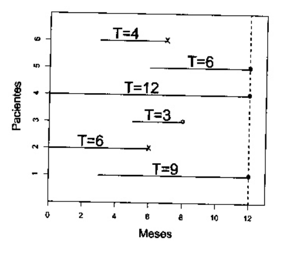
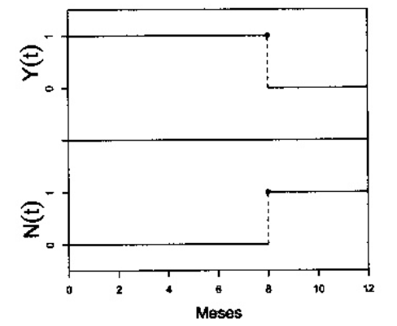

```{r setup, include=FALSE}
knitr::opts_chunk$set(echo = TRUE)
```

## Introdução

Estes exercícios podem ser encontrados no livro *Análise de Sobrevivência: teoria e aplicações em saúde*, de Carvalho, M. S. e colaboradores.

## Este primeiro bloco carrega bibliotecas e funções utilizadas.

```{r func, message = FALSE}
# Pacotes
library(tidyverse)
library(survival)
library(patchwork)

# Definição de algumas funções que serão usadas ao longo do exercício
# Trajetória do grupo
grup_traj <- function(data, tempo = tempo, id = id) {
  require(ggplot2)
  require(dplyr)
  data <- mutate(data, status2 = recode(status, `1` = 4, `0` = 1))
  y_breaks <- length(data$id)
  x_breaks <- max(data$tempo)

  ggplot(data) +
    geom_point(aes(tempo, id, shape = status2), size = 3) +
    geom_segment(aes(x = 0, y = id, xend = tempo, yend = id)) +
    scale_x_continuous(breaks = scales::extended_breaks(x_breaks),
                       name = "Meses") +
    scale_y_continuous(breaks = scales::extended_breaks(y_breaks),
                       name = "Paciente") +
    scale_shape_identity() +
    theme(panel.grid.minor = element_blank(),
          panel.grid.major = element_blank()) +
    coord_cartesian(xlim = c(0.25, x_breaks + 0.5))
}


# Trajetória do indivíduo
indiv_traj <- function(data, i) {
  require(ggplot2)
  require(patchwork)

  tmax  <- max(data$tempo.fim)
  t.ini <- data$tempo.ini[[i]]
  t.fim <- data$tempo.fim[[i]]
  censu <- data$status[[i]]

  individuo_n <- tibble(
    tempo2 = seq(0, tmax + 1, 1),
    Yx = ifelse(tempo2 >= t.ini & tempo2 < t.fim, 1, 0),
    Nx = ifelse(tempo2 >= t.fim & t.fim != tmax, 1, 0),
    status = data$status[[i]])

  pontos.Nx <- tibble(
    x = with(individuo_n, ifelse(Nx != lag(Nx), tempo2, NA_integer_)),
    y = with(individuo_n, ifelse(Nx != lag(Nx), 1, NA_integer_)),
    shape = ifelse(data$status[[i]] == 0 & x == data$tempo.fim[[i]], 1, 16))

  pontos.Yx <- tibble(
    x = with(individuo_n, ifelse(Yx != lag(Yx), tempo2, NA_integer_)),
    y = with(individuo_n, ifelse(Yx != lag(Yx), lag(Yx), NA_integer_)),
    shape = ifelse(data$status[[i]] == 0 & x == data$tempo.fim[[i]], 1, 16))

  g <- ggplot(individuo_n) +
    geom_step(aes(tempo2, Nx), direction = "hv", na.rm = TRUE) +
    geom_point(data = pontos.Nx,
               aes(x, y, shape = shape),
               size = 3,
               na.rm = TRUE) +
    scale_shape_identity() +
    scale_x_continuous(breaks = seq(0, tmax, 2),
                       minor_breaks = NULL,
                       limits = c(0, tmax),
                       name = "Meses") +
    scale_y_continuous(breaks = 0:1,
                       limits = c(-1, 2),
                       minor_breaks = NULL,
                       name = expression(N[i](x))) +
    theme_classic() +
    theme(panel.grid = element_blank())

  h <- ggplot(individuo_n) +
    geom_step(aes(tempo2, Yx), direction = "hv", na.rm = TRUE) +
    geom_point(
      data = pontos.Yx,
      aes(x, y, shape = shape),
      size = 3,
      na.rm = TRUE) +
    scale_shape_identity() +
    scale_x_continuous(limits = c(0, tmax), minor_breaks = NULL) +
    scale_y_continuous(
      breaks = 0:1,
      limits = c(-1, 2),
      minor_breaks = NULL,
      name = expression(Y[i](x))) +
    theme_classic() +
    theme(
      axis.title.x = element_blank(),
      axis.text.x = element_blank(),
      axis.ticks.x = element_blank(),
      panel.grid = element_blank()) +
    ggtitle(paste0("Paciente ", i))

  wrap_plots(h, g, nrow = 2)
}
```

## Exercício 2.1

O tempo de aleitamento, isto é, o tempo decorrido desde o nascimento até o desmame, pode ser considerado uma variável tempo de sobrevivência. Suponha que o tempo até o desmame em meses tenha sido registrado para 15 crianças que nasceram no mesmo dia:

    6 12 10 3 5 1 6 8 1 5 2 2 5 8 1

Considerando que não houve censura:

a. Represente graficamente os tempos de observação

```{r}
aleit <- tibble(id     = 1:15,
                tempo  = c(6, 12, 10, 3, 5, 1, 6, 8, 1, 5, 2, 2, 5, 8, 1),
                status = 1)

grup_traj(aleit)
```

b. Represente as trajetórias dos primeiros cinco indivíduos utilizando as variáveis N(t) e Y(t)

```{r}
aleit_cont <- mutate(aleit,
                     tempo.ini = 0L,
                     tempo.fim = as.integer(tempo),
                     tempo = tempo.fim - tempo.ini,
                     status = 1L)

indiv_traj(aleit_cont, 1)
indiv_traj(aleit_cont, 2)
indiv_traj(aleit_cont, 3)
indiv_traj(aleit_cont, 4)
indiv_traj(aleit_cont, 5)
```

c. Como você construiria um banco de dados para analisar esses dados pelo processo clássico?

```{r}
aleit
```


d. E pelo processo de contagem?

```{r}
aleit_cont
```

## Exercício 2.2

Considere agora o tempo de sobrevivência de 15 pacientes submetidos à hemodiálise. Neste caso, a variável de interesse é o tempo desde a primeira diálise até o óbito (em meses).

    2 4 29+ 6+ 3 1 1 2 3 9+ 10 11 5+ 5 1

Os tempos censurados estão indicados pelo sinal de +. Considere que todos os pacientes entraram juntos no início do estudo.

a. Represente graficamente os tempos de observação dos pacientes utilizando a notação clássica.

```{r}
dial <- tibble(
  id     = 1:15, 
  tempo  = c(2L, 4L, 29L, 6L, 3L, 1L, 1L, 2L, 3L, 9L, 10L, 11L, 5L, 5L, 1L), 
  status = c(1, 1, 0, 0, 1, 1, 1, 1, 1, 0, 1, 1, 0, 1, 1))

grup_traj(dial)
```

b. Represente as trajetórias dos primeiros cinco indivíduos utilizando as variáveis *N(t)* e *Y(t)* do processo de contagem.

```{r}
dial_cont <- cbind(dial, tempo.fim = dial$tempo, tempo.ini = 0)

indiv_traj(dial_cont, 1)
indiv_traj(dial_cont, 2)
indiv_traj(dial_cont, 3)
indiv_traj(dial_cont, 4)
indiv_traj(dial_cont, 5)
```

c. Construa um banco de dados para analisar esses dados pelo processo clássico.

```{r}
dial
```

d. Reconstrua o banco de dados, na forma de processo de contagem, considerando que essa é uma coorte aberta e as datas de início do tempo de observação de cada paciente são dadas pela tabela abaixo.

```{r}
dial_cont <- tibble(
  id        = 1:15,
  tempo.ini = c(0, 1, 12, 3, 1, 7, 0, 1, 1, 3, 12, 4, 4, 1, 22),
  tempo     = c(2L, 4L, 29L, 6L, 3L, 1L, 1L, 2L, 3L, 9L, 10L, 11L, 5L, 5L, 1L),
  tempo.fim = tempo + tempo.ini,
  status    = c(1, 1, 0, 0, 1, 1, 1, 1, 1, 0, 1, 1, 0, 1, 1)
)

dial_cont
```

## Exercício 2.3

Em um hospital, seis pacientes HIV positivo são acompanhados ao longo de um ano. No gráfico a seguir, as linhas horizontais representam o tempo de acompanhamento de cada paciente: linhas terminadas em "X" indicam a ocorrência do desfecho (óbito), linhas terminadas em com "o" indicam censuras. Represente, utilizando as variáveis *N(t)* e *Y(t)*, as trajetórias de cada um dos seis pacientes.



```{r}
aids <- tibble(id = 1:6,
               tempo = c(4, 6, 12, 3, 6, 9),
               tempo.ini = c(3, 6, 0, 5, 0, 3),
               tempo.fim = tempo + tempo.ini,
               status = c(1, 0, 0, 0, 1, 0))
aids


# Trajetórias
indiv_traj(aids, 1)
indiv_traj(aids, 2)
indiv_traj(aids, 3)
indiv_traj(aids, 4)
indiv_traj(aids, 5)
indiv_traj(aids, 6)
```


## Exercício 2.4

Considerando a trajetória observada de um paciente apresentada na figura abaixo, responda:


a. Qual foi o mês de entrada do paciente no estudo?

    O paciente entrou no estudo no mês 2.

b. Em que mês ocorreu o desfecho?

    O desfecho ocorreu no mês 4.

c. Em que meses o paciente esteve sob risco de óbito?

    Nos meses 3 e 4.

## Exercício 2.5

Outro paciente tem a seguinte trajetória de observação:



Com base neste gráfico, responda:

a. Qual foi a data de entrada do paciente no estudo?

    O paciente entrou no estudo no início, ou seja, no t = 0.
    
b. Em que data ocorreu o desfecho?

    O desfecho ocorreu no mês 8.
    
## Exercício 2.6

Considere seis indivíduos em uma coorte para avaliação de fatores de risco para infecção por HIV. O estudo iniciou-se em 01/06/2008, quando dois dos indivíduos entraram no estudo, com resultados negativos para a infecção. Um deles, ao realizar o segundo exame, um mês depois, apresentou resultado positivo, e o outro, positivou dois meses depois. O outros quatro indivíduos entraram no estudo em 01/07/2008, 01/09/2008, 01/08/2008, e 01/08/2008 e suas respectivas datas de soroconversão foram 2, 3, 2 e 5 meses após a entrada.

a. Construa o banco de dados no formato clássico.

```{r}
(hiv <- tibble(
  id     = 1:6,
  tempo = c(1, 3, 2, 3, 2, 5),
  status = 1))
```

b. Construa o banco de dados na forma de processo de contagem.

```{r}
(hiv_cont <- tibble(id     = 1:6,
                   tempo.ini  = c(0, 0, 1, 3, 2, 2),
                   tempo = c(1, 3, 2, 3, 2, 5),
                   tempo.fim  = tempo.ini + tempo,
                   status = 1))
```

c. Represente graficamente os tempos observados desses indivíduos.

```{r}
grup_traj(hiv_cont)
```

d. Represente as trajetórias dos 6 indivíduos utilizando *N(t)* e *Y(t)*.

```{r}
indiv_traj(hiv_cont, 1)
indiv_traj(hiv_cont, 2)
indiv_traj(hiv_cont, 3)
indiv_traj(hiv_cont, 4)
indiv_traj(hiv_cont, 5)
indiv_traj(hiv_cont, 6)
```

e. Quais são os indivíduos em risco no quinto mês de estudo.

```{r}
filter(hiv_cont, tempo.ini < 5, tempo.fim >= 5)
```

f. Que tipo de censura ocorreu neste estudo?

    Censura intervalar.

g. Em que situação ocorreria truncamento?

    Truncamento a esquerda ocorreria no caso de pacientes positivarem no teste
    inicial, pois eles teriam positivado fora da janela temporal do estudo.
    Truncamento a direita ocorreria se o estudo analisasse apenas os casos de
    pacientes que positivaram durante a janela temporal.
    
## Exercício 2.7

Para se familiarizar com o R e com o banco de dados do Ipec (ipec.csv, veja o Apêndice, seção Aids - clássico) que será utilizado nos próximos capítulos, inicie a análise de sobrevivência observando os dados dos pacientes:

a. No formato clássico.

```{r, message = FALSE}
(ipec <- read_csv2("ipec.csv"))
with(ipec, Surv(tempo, status))
```

b. No formato de processo de contagem.

```{r}
with(ipec, Surv(ini, fim, status))
```

c. Observe a saída nos dois formatos. Quais os tempos e status do 1º e 79º pacientes em cada um dos formatos?

```{r}
with(ipec, Surv(tempo, status))[c(1, 79)]
with(ipec, Surv(ini, fim, status))[c(1, 79)]
```

    No formato clássico, o primeiro paciente foi observado por período de 852
    dias, ao fim do qual sofreu o desfecho. O segundo paciente foi observado por
    2304 dias, ao fim do qual foi censurado.
    
    No formato de processo de contagem, o primeiro paciente começou a ser 
    observado no dia 1243 e deixou de ser observado no dia 2095 em razão de ter
    sofrido o desfecho. O segundo paciente começou a ser observado no dia 2465 e
    deixou de ser observado no dia 4769 em razão de ter sofrido censura.

## Exercício 2.8

Ainda com os dados do Ipec, organize o banco de dados e faça uma análise exploratória das variáveis de interesse.

a. Verifique as dimensões dos dados.

```{r}
dim(ipec)
```

b. Veja quais são as variáveis que constam nos dados

```{r}
names(ipec)
```

c. Substitua os dados faltantes (codificados com 9, 99 ou I) por *NA* (padrão do R).

```{r}
ipec$anotrat[ipec$anotrat == 9] <- NA
ipec$obito[ipec$obito == "I"] <- NA
```

d. Indique ao R quais são as variáveis categóricas que estão erroneamente classificadas como numéricas pelo R (isso acontece quando números são utilizados para codificar as categorias).

```{r}
ipec$escola <- factor(
  ipec$escola,
  labels = c("sem", "fundam", "medio", "sup")
)

ipec$risco <- factor(
  ipec$risco,
  labels = c("Homo", "UDI", "Transf", "Cont hetero", "Mut parc", "2 fat")
)

ipec$acompan <- factor(
  ipec$acompan,
  labels = c("Amb", "Int.Post", "Int.Imed")
)

ipec$anotrat <- factor(ipec$anotrat)

ipec$tratam <- factor(
  ipec$tratam,
  labels = c("Nenhum", "Mono", "Combinada", "Potente")
)

ipec$doenca <- factor(
  ipec$doenca,
  labels = c("PCP", "TB pulm", "TB diss", "Toxo", "SK",
             "Outra", "Cand", "Herpes", "Duas", "Def CD4")
  )

ipec$propcp <- factor(
  ipec$propcp,
  labels = c("Sem", "Prim", "Secund", "Ambas")
)
```

e. Calcule as medidas resumo das variáveis presentes no banco.

```{r}
summary(ipec)
```

f. Construa tabelas de frequência para as variáveis de maior interesse.

```{r}
table(ipec$status)
table(ipec$sexo)
table(ipec$escola)
table(ipec$risco)
table(ipec$acompan)
table(ipec$anotrat)
table(ipec$tratam)
table(ipec$doenca)
table(ipec$propcp)
```

g. Construa gráficos para o tempo de sobrevivência e para outras variáveis de interesse.

```{r, warning=FALSE}
boxplot(
  tempo ~ status,
  data = ipec,
  main = "Tempo por status",
  ylab = "Tempo(dias)",
  xlab = "Desfecho")

boxplot(
  tempo ~ sexo,
  data = ipec,
  main = "Tempo por sexo",
  ylab = "Tempo(dias)",
  xlab = "Sexo")

boxplot(
  tempo ~ escola,
  data = ipec,
  main = "Tempo por escolaridade",
  ylab = "Tempo(dias)",
  xlab = "Escolaridade")

boxplot(
  tempo ~ risco,
  data = ipec,
  main = "Tempo por risco",
  ylab = "Tempo(dias)",
  xlab = "Risco")

boxplot(
  tempo ~ acompan,
  data = ipec,
  main = "Tempo por acompanhamento",
  ylab = "Tempo(dias)",
  xlab = "Risco")

boxplot(
  tempo ~ tratam,
  data = ipec,
  main = "Tempo por tratamento",
  ylab = "Tempo(dias)",
  xlab = "Tratamento")

boxplot(
  tempo ~ doenca,
  data = ipec,
  main = "Tempo por doença",
  ylab = "Tempo(dias)",
  xlab = "Doença")

boxplot(
  tempo ~ propcp,
  data = ipec,
  main = "Tempo por propcp",
  ylab = "Tempo(dias)",
  xlab = "Propcp")

hist(
  ipec$tempo,
  main = "Sobrevivência",
  ylab = "Freqüência",
  xlab = "Dias")

hist(
  ipec$tempo/30,
  breaks = seq(0, 120, 6),
  at     = seq(0, 120, 12),
  main   = "Sobrevivência",
  ylab   = "Freqüência",
  xlab   = "Meses")

hist(
  ipec$idade,
  main = "Idade",
  ylab = "Frequência",
  xlab = "Idade")
```

