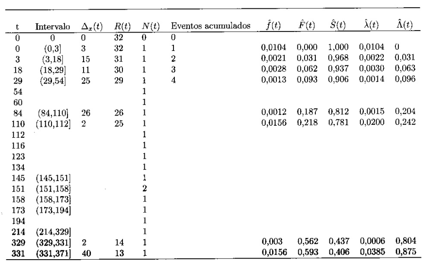

```{r setup, include=FALSE}
knitr::opts_chunk$set(echo = TRUE)
options(digits = 4)
```

Exercícios do terceiro capítulo do livro "Análise de sobrevivência: teoria e aplicações em saúde".

## Pacotes e funções

Esta parte inicial é dedicada ao carregamento de pacotes e definição de funções utilizadas posteriormente.

```{r, message = FALSE}
library(tidyverse)
library(survival)
```

## Exercício 3.1

A figura a seguir mostra uma curva de sobrevivência. Com base nesta curva, identifique.


(a). A probabilidade de sobreviver por mais de 10 dias.

    Observando a curva, o valor do $S(t)$ correspondente a $t = 10$ seria 
    $\approx 0.1$ .

(b). A sobrevivência mediana e o tempo mediano de sobrevivência.

    A sobrevivência mediana é o momento em que a função atinge 0.5, ou 
    $t \approx 6$.

(c). O tempo em que 80% dos pacientes ainda estavam vivos.

    Corresponde ao tempo em que $y = 0.8$, ou seja, $t \approx 4$.

## Exercício 3.2 

Sabendo-se que a probabilidade de sobreviver por mais de 100 dias após o transplante de coração é igual a 0.7, calcule:

(a). A probabilidade de sobreviver por, no máximo, 100 dias (inclusive).

    Considerando que a probabilidade de sobreviver por mais de 100 dias 
    corresponde a função de sobrevivência $S(t) = 0.7$, sabemos que a 
    probabilidade de sobreviver até 100 dias é dada pela função
    $F(t) = 1 - S(t)$. Ou seja, $F(t) = 0.3$.

(b). O risco acumulado do óbito ocorrer em até 100 dias (ou seja, em no máximo 100 dias).

    Sabemos que o risco acumulado $\Lambda$ de um evento ocorrer até o tempo $t$
    pode ser estimado por $\Lambda = -\ln(S(t))$, ou seja `r -log(0.7)`.

(c). O risco acumulado do óbito ocorrer após 100 dias (ou seja, no mínimo em 100 dias).

    O risco acumulado do óbito após o centésimo dia seria dado por 
    $\Lambda = -ln(F(t))$, ou seja: `r -log(0.3)`.

## Exercício 3.3

A tabela a seguir mostra o tempo até o óbito de todos os pacientes de uma coorte de 32 indivíduos vivendo com Aids, não havendo tempos censurados. Complete as lacunas em branco na tabela usando as definições e relações entre as funções básicas de sobrevivência, onde T é o tempo até o óbito, R(t) é o número de pessoas sob risco no início do intervalo de tempo e N(t) é o número de óbitos ocorridos no intervalo de tempo.



```{r}
# Inicializar o banco com os valores conhecidos
aids <- tibble(
    t = c(0, 3, 18, 29, 54, 60, 84, 110, 112, 116, 123,
          134, 145, 151, 158, 173, 194, 214, 329, 331, 371),
    Rt = c(32:12),
    Nt = c(rep(1, 13), 2, rep(1, 7))
)

# Calcular as outras variáveis a partir das funções
tabela <- 
    aids %>% 
    mutate(
        inter    = lead(cut(t, breaks = t)), 
        delta    = lead(t, default = ) - t,
        acum     = cumsum(Nt),
        ft       = Nt / (Rt[1] * delta),
        Ft       = acum / Rt[1], 
        St       = 1 - Ft,
        lambda_t = Nt / (Rt * delta),
        Lambda_t_discreta = 
            cumsum(lag(lambda_t, default = 0) * lag(delta, default = 0)),
        Lambda_t_continua = ifelse(t == 0, 0, -log(lag(St)))
    ) %>% 
    filter(t != last(t))

names <- c("$t$", "$R(t)$", "$N(t)$", "Intervalo", "$\\Delta_x(t)$", 
           "Eventos Acumulados", "$\\hat{f}(t)$", "$\\hat{F}(t)$", 
           "$\\hat{S}(t)$", "$\\hat{\\lambda}(t)$", "$\\hat{\\Lambda}(t)$",
           "${\\Lambda}(t)$")

knitr::kable(
    tabela,
    format = "markdown",
    digits = 4,
    col.names = names,
    align = "c"
)
```

## Exercício 3.4

Lembrando que o evento é óbito em pacientes vivendo com Aids, e interpretando a tabela do exercício anterior, responda:

(a). Qual o tempo mediano de sobrevivência desta coorte?  
- O tempo mediano de sobrevivência é o ponto onde a função de sobrevivência é 0.5, ou seja:

```{r}
tabela %>% filter(St == 0.5) %>% select(t)
```


(b). O que significa o valor atribuído a $\hat{S}(214)$?  
- O valor atribuído a $\hat{S}(214)$ é a probabilidade de sobreviver a um tempo superior a 214 unidades.

(c). O que significa o valor atribuído a $\hat{F}(214)$?  
- Da forma análoga a anterior, é a probabilidade de sobreviver até 214 unidades de tempo.

(d). O que significa o valor atribuído a $\hat{\lambda}(214)$?  
- Trata-se do risco de óbito após sobreviver 214 unidades de tempo.

(e). O que significa o valor atribuído a $\hat{\Lambda}(214)$?  
- Trata-se do risco de óbito do paciente até as 214 unidades de tempo. 
