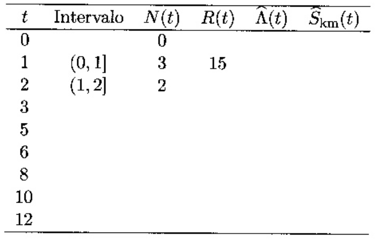

```{r setup, include=FALSE}
knitr::opts_chunk$set(echo = TRUE)
```

## Pacotes e opções

```{r pkgs, message=FALSE}
library(dplyr)
library(survival)
```


## Exercícios

### 4.1 {#q4_1}

Considere os dados de tempo de aleitamento de 15 crianças, descrito no exercício 2.1.

    6 12 10 3 5 1 6 8 1 5 2 2 5 8 1

a. Complete a tabela Kaplan-Meier abaixo com esses dados



```{r q4_1a}
x = c(6L, 12L, 10L, 3L, 5L, 1L, 6L, 8L, 1L, 5L, 2L, 2L, 5L, 8L, 1L)

t = sort(unique(x))
inter = lead(cut(c(0,t), breaks = c(0,t)))[1:length(t)]
Nt = as.numeric(table(x))
Rt = rev(cumsum(rev(Nt)))
Skm = cumprod((Rt - Nt)/Rt)
Lambda = -log(Skm)

aleit <- data.frame(t, inter, Nt, Rt, Lambda, Skm)

names <- c("$t$", "Intervalo", "$N(t)$", "$R(t)$",
           "$\\hat{\\Lambda}(t)$", "$\\hat{S}_{km}(t)$")

knitr::kable(aleit, digits = 4, col.names = names)
```

b. Desenhe a curva de Kaplan Meier correspondente aos dados.

```{r}
y <- Surv(x, rep(1, length(x)))
y_fit <- survfit(y ~ 1)
plot(
  y_fit,
  conf.int = F,
  main = "Tempo de aleitamento",
  xlab = "Meses",
  ylab = expression(hat(S)[km](t))
)
```

c. Qual a probabilidade de uma criança ser amamentada pelo menos até o sexto mês de vida?

```{r}
plot(
  y_fit,
  conf.int = F,
  main = "Tempo de aleitamento",
  xlab = "Meses",
  ylab = expression(hat(S)[km](t))
)
abline(h = 0.2667, v = 6, lty = 2)
```

A probabilidade é de $S(6) = 0,2667$.

d. Qual a probabilidade de ser amamentada por mais de 3 meses?

```{r}
plot(
  y_fit,
  conf.int = F,
  main = "Tempo de aleitamento",
  xlab = "Meses",
  ylab = expression(hat(S)[km](t))
)
abline(h = 0.6, v = 3, lty = 2)
```

A probabilidade é de $S(3) = 0,6$.

e. Qual a probabilidade de ser amamentada por mais de 10 meses?

```{r}
plot(
  y_fit,
  conf.int = F,
  main = "Tempo de aleitamento",
  xlab = "Meses",
  ylab = expression(hat(S)[km](t))
)
abline(h = 0.0667, v = 10, lty = 2)
```

A probabilidade é de $S(10) = 0,0667$.

f. Qual o tempo mediano de aleitamento?

O tempo mediano de aleitamento é dado pela valor de $S(t)\le 0,5$.

```{r}
plot(
  y_fit,
  conf.int = F,
  main = "Tempo de aleitamento",
  xlab = "Meses",
  ylab = expression(hat(S)[km](t))
)
abline(h = 0.5, v = 5, lty = 2)
```

No caso, o valor mais próximo que satisfaz esta condição é $t = 5$, para o qual o valor de $S(t)$ é $0,4$. Ou seja: $$\hat{S}_{km}(5) = 0,4$$

### 4.2

Ainda com os dados do aleitamento construa a tabela de risco usando os estimadores Kaplan Meier e Nelson-Aalen.

```{r q4_2}
t = sort(unique(x))
inter = lead(cut(c(0,t), breaks = c(0,t)))[1:length(t)]
Nt = as.numeric(table(x))
Rt = rev(cumsum(rev(Nt)))
Skm = cumprod((Rt - Nt)/Rt)
Lkm = -log(Skm)
Lna = cumsum(Nt/Rt)

aleit_na <- data.frame(t, inter, Nt, Rt, Lkm, Lna)

names <- c("$t$", "Intervalo", "$N(t)$", "$R(t)$",
           "$\\hat{\\Lambda}_{km}(t)$", "$\\hat{\\Lambda}_{na}(t)$")

knitr::kable(aleit_na, digits = 4, col.names = names)
```

### 4.3

Os dados completos de tempo de aleitamento (estudo fictício) estão presentes no arquivo *leite.txt*, Apêndice 12.4. Abra este banco de dados no R e:

a. Costrua a tabela Kaplan-Meier. Verifique qual o tempo mediano de aleitamento na saída do R.
    - Como não foi possível importar o arquivo *leite.txt*, construímos o banco "manualmente" [acima](#q4_1).
```{r}
aleit_fit <- survfit(Surv(x) ~ 1)
summary(aleit_fit)
```

b. Construa a curva de sobrevivência do aleitamento indicando seu ponto mediano.

```{r}
plot(
  aleit_fit,
  conf.int = F,
  main = "Tempo de aleitamento",
  xlab = "Meses",
  ylab = expression(hat(S)[km](t))
)

lines(list(x = c(-0.5,   5,    5),
           y = c(0.4, 0.4, -0.5)),
      lty = 2)
points(5, 0.4, pch = 16)

text(5, 0.4, "Mediana", adj = c(-0.05, -0.2))
```

c. Calcule as estimativas de Nelson-Aalen usando a função `coxph()`.

```{r}
al_fit_na <- survfit(coxph(Surv(x) ~ 1))
al_fit_na
summary(al_fit_na)
```

### 4.4

Em que situação se deve dar preferência as estimativas de Nelson-Aalen?
    
|      Para amostras maiores, os resultados das estimativas de Kaplan-Meier  e Nelson-Aalen tendem a convergir, porém, para pequenas amostras (n 
|      < 100), Nelson-Aalen é mais indicado por ter propriedades estatísticas vantajosas, além de produzir estatísticas mais conservadoras, 
|      especialmente no final do período.

### 4.5

Suponha que os tempos de aleitamento de 60 bebês estejam agrupados em quatro comunidades diferentes:

    Comunidade 1: 6 12 10 3 5 1 6 8 1 5 2 2 5 8 1
    Comunidade 2: 5 12 10 4 4 3 6 9 2 6 4 1 7 10 1
    Comunidade 3: 13 14 20 3 5 1 8 15 2 5 3 2 6 15 1
    Comunidade 4: 1 16 20 1 1 1 1 2 2 13 3 1 1 14 2

|     Construímos o banco leite2 abaixo, manualmente.

```{r}
leite2 <- data.frame(id = 1:60,
           tempo = c(6L, 12L, 10L, 3L, 5L, 1L, 6L, 8L, 1L, 5L, 2L, 2L,
                     5L, 8L, 1L, 5L, 12L, 10L, 4L, 4L, 3L, 6L, 9L, 2L,
                     6L, 4L, 1L, 7L, 10L, 1L, 13L, 14L, 20L, 3L, 5L, 1L,
                     8L, 15L, 2L, 5L, 3L, 2L, 6L, 15L, 1L, 1L, 16L, 20L,
                     1L, 1L, 1L, 1L, 2L, 2L, 13L, 3L, 1L, 1L, 14L, 2L),
           status = 1,
           grupo = rep(1:4, each = 15))
leite2
```

a. Ajuste um modelo de Kaplan-Meier estratificado por comunidade e compare o tempo mediano de aleitamento em cada comunidade.

```{r}
survfit(Surv(tempo, status) ~ grupo, data = leite2)
```

O tempo mediano de sobrevivência estimado é similar nos primeiros 3 grupos, porém, é bastante inferior no grupo 4.

b. Desenhe, no mesmo gráfico, as curvas de Kaplan-Meier, estratificadas por grupo. Como se comporta a curva de sobrevivência das outras comunidades quando comparadas a comunidade 1?

```{r}
plot(survfit(Surv(tempo, status) ~ grupo, data = leite2),
     col = 1:4, lty = 1:4)
legend("topright", c("Com. 1", "Com. 2", "Com. 3", "Com. 4"), fill = 1:4)
```

|      A comunidade 2 tem uma sobrevivência parecida com a 1, estimativas levemente melhores em alguns pontos.

|      A comunidade 3 tem uma sobrevivência parecida com a comunidade 1 no ínicio do período, mas para o final do período, tem uma sobrevivência bem melhor. 

|      A comunidade 4 tem uma sobrevivência pior que a 1 no início do período, mas no final do período, apresenta uma sobrevivência maior e comparável a comunidade 3.

c. Use os testes log-rank e Peto para a variável `grupo`. Analise as funções de sobrevivência das quatro comunidades. A que conclusões você chega com esta análise? Existe diferença entre as comunidades quanto ao tempo de aleitamento?

```{r}
survdiff(Surv(tempo, status) ~ grupo, data = leite2)
survdiff(Surv(tempo, status) ~ grupo, rho = 1, data = leite2)
```

Em ambos os casos observamos diferenças entre os valores observados e esperados nos grupos, porém, os p-valores são muito altos (0.5 e 0.3), o que sugere que os resultados podem ser resultado de variações amostrais e não necessariamente de diferenças entre as comunidades. Então, as diferenças entre os grupos não são estatisticamente significativas.

### 4.6

O banco de dados `ipec.csv` contém os dados de uma coorte de pacientes com Aids atendidos no Ipec e descritos no apêndice 12.4. Para este estudo foi definido, como tempo de sobrevivência, o tempo entre o diagnóstico de Aids (critério CDC-1993) e o óbito.

```{r}
# Leitura-limpeza do banco ipec.csv
ipec <- read.csv2("ipec.csv")

ipec$anotrat[ipec$anotrat == 9] <- NA
ipec$obito[ipec$obito == "I"] <- NA

ipec$escola <- factor(
  ipec$escola,
  labels = c("sem", "fundam", "medio", "sup")
)

ipec$risco <- factor(
  ipec$risco,
  labels = c("Homo", "UDI", "Transf", "Cont hetero", "Mut parc", "2 fat")
)

ipec$acompan <- factor(
  ipec$acompan,
  labels = c("Amb", "Int.Post", "Int.Imed")
)

ipec$anotrat <- factor(ipec$anotrat)

ipec$tratam <- factor(
  ipec$tratam,
  labels = c("Nenhum", "Mono", "Combinada", "Potente")
)

ipec$doenca <- factor(
  ipec$doenca,
  labels = c("PCP", "TB pulm", "TB diss", "Toxo", "SK",
             "Outra", "Cand", "Herpes", "Duas", "Def CD4")
  )

ipec$propcp <- factor(
  ipec$propcp,
  labels = c("Sem", "Prim", "Secund", "Ambas"))


```


a. Amplie a análise exploratória desses dados usando o R:
    1. Qual é a idade média desses pacientes?  
    2. Qual a razão homens:mulheres nessa coorte?
    3. Quantos receberam tratamento?
    4. Quantos foram a óbito e quantos foram censurados?
    5. Os óbitos e as censuras se concentraram no final do estudo ou ocorreram durante todo o período?
    6. Qual o tempo de sobrevivência mediano?
    
```{r}
# Idade média dos pacientes
mean(ipec$idade)

# Razão entre homens e mulheres
x <- table(ipec$sexo)
as.numeric(x[2]/x[1])

# Quantos receberam tratamento?
x <- table(ipec$tratam)
sum(x[2:4])

# Nº de óbitos e censuras
x <- table(ipec$status)
paste0(x[1], " foram censurados.")
paste0(x[2], " foram a óbito.")

# Dispersão temporal de óbitos e censuras
hist(ipec$tempo[ipec$status == 1], main = "Óbitos")
hist(ipec$tempo[ipec$status == 0], main = "Censuras")

# Os óbitos concentraram-se principalmente no início do período, enquanto as censuras se distribuíram mais ao longo do período de estudo.

# Tempo de sobrevivência mediano 
km <- survfit(Surv(tempo, status) ~ 1, data = ipec)
km$surv[km$surv <= 0.5][1]
```
    
b. Existe diferença entre homens e mulheres quanto ao tempo de sobrevivência pós-diagnóstico de Aids?

```{r}
sexo <- survfit(Surv(tempo, status) ~ sexo, data = ipec)
sexo
```

Existe uma diferença bastante expressiva entre homens e mulheres considerando que o tempo mediano de sobrevivência dos homens é de 1116 dias enquanto as mulheres sequer chegaram a esse patamar de sobrevivência, sendo que o menor valor da função de sobrevivência foi $S(t) = 0.521$.

c. Compare homens e mulheres segundo tempos de sobrevivência mediano e percentis 75 e 90.

```{r}
summary(sexo)
```

O valor da sobrevivência mediana dos homens é de 1116 dias, enquanto para as mulheres, não foi possível calcular este percentil, já que o estudo foi encerrado antes que a função de sobrevivência atingisse 0.5.

O valor do percentil 0.75 para os homens foi de 397 dias, enquanto para as mulheres foi de 854. Já o percentil 0.9 para os homens foi de 108 dias, enquanto as mulheres atingiram este marca em 151 dias.

d. Existe diferença na sobrevivência dos pacientes submetidos aos diferentes tipos de tratamento (variável `tratam`)?

```{r}
tratam <- survfit(Surv(tempo, status) ~ tratam, data = ipec)
tratam
```

Há uma diferença considerável entre as sobrevivências de pacientes de acordo com o tratamento recebido. Os pacientes que não receberam nenhum tratamento têm mediana de 173 dias, enquanto os pacientes tratados com um medicamento têm  mediana de 1226 dias, já os que receberam o tratamento combinado têm mediana de 2898 dias. Os que receberam o tratamento "Potente" têm mediana desconhecida, provavelmente devido ao pequeno número de eventos observados (apenas 1).

e. Existe diferença na sobrevivência de pacientes com diferentes graus de escolaridade?

```{r}
escola <- survfit(Surv(tempo, status) ~ escola, data = ipec)
escola
```

Sim, existe diferença na sobrevivência segundo escolaridade. Os pacientes com escolaridade média tem maior sobrevivência, enquanto as pessoas com nível superior de escolaridade de menor sobrevivência.

